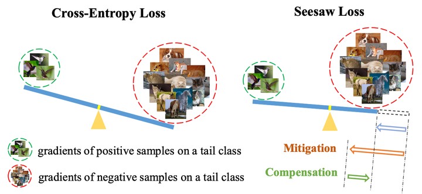
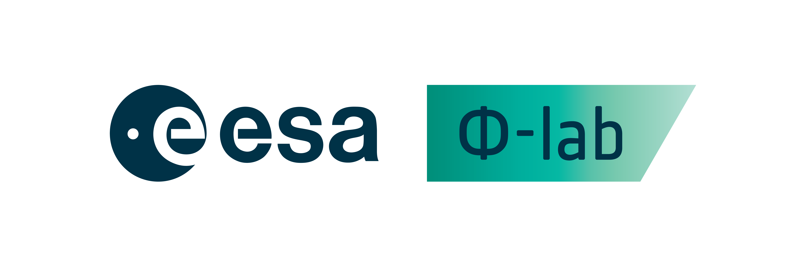

# Binary Seesaw Loss


A modular and lightweight **PyTorch** implementation of Binary Seesaw Loss, adapted from the original Seesaw Loss introduced by [Wang et al., CVPR 2021](https://arxiv.org/pdf/2008.10032). This version targets **binary semantic segmentation** tasks, such as vessel extraction or anomaly detection, where foreground-background imbalance is a critical challenge.




> **Disclaimer**:  The code is under development. (Developed by **Eva Gmelich Meijling** and **Roberto Del Prete**).


##### - Powered by


## Table of Contents
- [Overview](#overview)
- [Installation](#installation)
- [Usage](#usage)
- [Loss Formula](#loss-formula)
- [Example](#example)
- [Citations](#citations)
- [License](#license)


## Overview

Binary Seesaw Loss is a reformulation of cross-entropy loss designed to mitigate class imbalance in binary segmentation. It dynamically adjusts the gradient contribution of the majority and minority classes by applying a sample-aware modulation factor. This encourages learning from hard examples while suppressing overconfident predictions on dominant classes.

## Installation

Clone the repository and copy the loss implementation:
```bash
git clone https://github.com/yourusername/SegSeesawLoss.git
cp ./SegSeesawLoss/seesaw_loss/binary_seesaw_loss.py .
```

## Usage

Import and integrate into your PyTorch training pipeline:
```python
from binary_seesaw_loss import BinarySeesawLoss

# Initialize loss with custom hyperparameters
criterion = BinarySeesawLoss(p=0.8, q=2.0)

# During training
loss = criterion(predictions, targets)
```


## Example

Minimal training loop snippet:
```python
for inputs, targets in dataloader:
    outputs = model(inputs)
    loss = criterion(outputs, targets)
    loss.backward()
    optimizer.step()
    optimizer.zero_grad()
```

## Citations

This work builds on the Seesaw Loss proposed for instance segmentation. Please cite the original paper:
```
@inproceedings{wang2021seesaw,
  title={Seesaw Loss for Long-Tailed Instance Segmentation},
  author={Wang, Jiaqi and Song, Yu and Li, Xin and Sun, Xiaogang},
  booktitle={CVPR},
  year={2021}
}
```

## License
This project is licensed under the MIT License.
